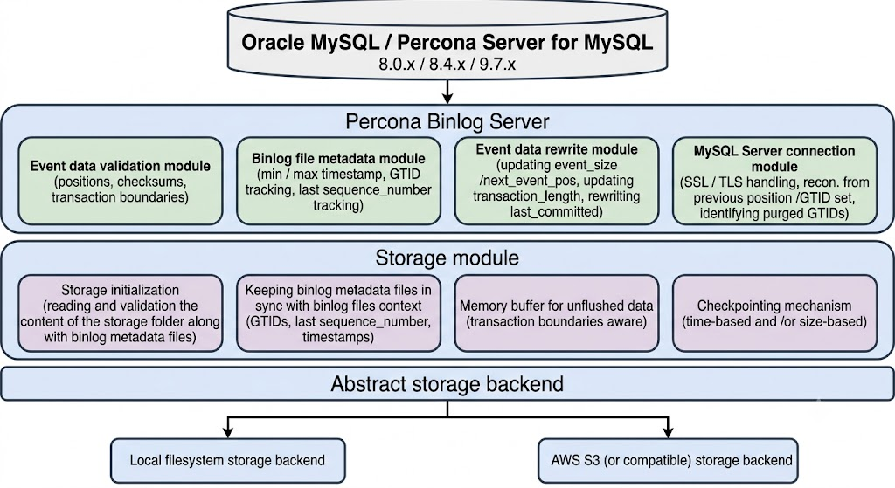

# Percona Binary Log Server

## Architecture

Percona Binary Log Server runs as a single process. The tool connects to a MySQL or MySQL-compatible source as a [replication client](glossary.md#replication-client). The tool reads [binary log](glossary.md#binary-log) events over the replication protocol and writes the events to the [storage](glossary.md#storage) you configure: a local filesystem or [S3-compatible](glossary.md#s3-compatible-storage) object storage.

### Data path and process model

The tool uses one configuration file and one process. Percona Binary Log Server runs without separate `archiver` or `uploader` daemons. The tool writes data to storage only at [transaction boundary](glossary.md#transaction-boundary) points. After a restart, the tool [resumes](glossary.md#resume) automatically from state that the tool stored next to the binlogs. For the full model, see [Core behavior](operational-behavior-reference.md).

### Operational modes (outcomes)

`binlog_server` runs in one of two modes, `fetch` or `pull`, depending on the subcommand. See [Command Reference](command-reference.md). Each mode opens a single replication connection to the source. The tool does not use connection pools.

* [`fetch`](glossary.md#fetch). Reads every binlog event available on the source, writes the events to your storage, and exits. Use `fetch` for snapshots or scheduled jobs. Any error stops the run. Storage stays consistent up to the last flushed transaction. `fetch` does not reconnect automatically.

* [`pull`](glossary.md#pull). Runs continuously. The tool reads each subsequent binlog event until you stop the process. After a network failure or a source outage, the tool reconnects and resumes from saved metadata. The retry interval comes from `replication.idle_time` and related settings. For the exact meaning of wait, idle, and reconnect, see [Core behavior](operational-behavior-reference.md#network-failure-and-reconnect-behavior).

* [Graceful shutdown](glossary.md#graceful-shutdown). When the tool receives SIGINT or SIGTERM, the tool flushes data through the last completed transaction and then exits. Shutdown can take up to the value of your connection read timeout. See [Graceful shutdown](operational-behavior-reference.md#graceful-shutdown) in Core behavior.

### Transaction-safe writes

Stored binlogs are the basis for recovery. A partial transaction in a stored file makes the file unusable for recovery. To prevent partial transactions, Percona Binary Log Server flushes data only at transaction boundaries. The tool can also verify event checksums with `replication.verify_checksum`. After a hard kill, storage remains consistent up to the last flushed transaction. The next start repairs leftover `*.tmp` objects and a size mismatch on the current binlog file. For full details, see [Core behavior](operational-behavior-reference.md#transaction-atomicity-and-partial-writes) and [Automatic storage recovery](operational-behavior-reference.md#automatic-storage-recovery).

## Capabilities and operational caveats

* Resume without re-download. The next run continues from stored metadata. You do not need to track the position manually.

* Search by time or [GTID set](glossary.md#gtid-set). [`search_by_timestamp`](glossary.md#search_by_timestamp) returns the first N metadata records of stored files, from the oldest up to the file whose per-file `min_timestamp` (the earliest event timestamp in that file, recorded in the file's metadata — not an argument you pass) is at or before the time you supply. [`search_by_gtid_set`](glossary.md#search_by_gtid_set) returns a minimal cover of stored files for a requested GTID set. Pass the returned files to your recovery tool or to a downstream pipeline.

* Archive directly to [S3](glossary.md#s3) or to S3-compatible storage with configurable [checkpoints](glossary.md#checkpoint). Events are buffered in memory (and, on flush, staged through a local directory set by `storage.fs_buffer_directory`) before each S3 upload — the server does **not** push per transaction. Flush frequency is controlled by `storage.checkpoint_size` and `storage.checkpoint_interval`. Because S3 has no append API, every flush re-uploads the cumulative object, so under-tuned checkpoints can amplify transferred bytes well above the final binlog size (for example, a 1 GB binlog flushed at `checkpoint_size: 256M` transfers 2.5 GB in total). See [S3 checkpointing behavior](storage-reference.md#s3-checkpointing-behavior), [Memory footprint](operational-behavior-reference.md#impact-on-the-primary-memory-footprint-and-internal-flow), and [Storage Reference](storage-reference.md).

* S3 operations are your responsibility. You manage [IAM](glossary.md#iam) (Identity and Access Management) and credentials. An expired or revoked role stops writes until you restore the role. Throttling can trigger AWS SDK retries. Watch the logs and alert on storage errors. To stop the tool cleanly, send SIGINT or SIGTERM. `kill -9` can drop unwritten data.

* Single replication account, narrow privileges. The tool connects with one MySQL user that needs only `REPLICATION SLAVE`. `REPLICATION CLIENT` is not required, and no `SUPER` or `BACKUP_ADMIN` privilege is needed. See [Configuration Reference](configuration-reference.md#connection).

* No built-in failover or topology awareness. The tool reconnects to whatever `connection.host`/`port` (or `connection.dns_srv_name`) resolves to, without checking whether the node is a primary, a replica, or in read-only state. Run in GTID mode and point the connection at a write-tracking endpoint (a proxy with health checks, a DNS SRV record fronted by health checks, or an operator-managed primary service) so that failover does not corrupt the resume cursor. Every node that could be promoted must have `log_replica_updates=ON` (see also the PXC note below). For the full failure model, see [Failover and topology awareness](operational-behavior-reference.md#failover-and-topology-awareness).

* No built-in retention or purging. Storage grows without bound. Plan deletion externally — for example, an S3 Object Lifecycle policy for the `s3` backend, or a scheduled job for the `file` backend — and never delete the current binlog file, its `*.json` companion, or files that earlier files still chain to through `previous_gtids`. See [Retention](operations.md#retention) for the safe-deletion rules.

## When not to use Percona Binary Log Server

If your source is [Percona XtraDB Cluster](glossary.md#percona-xtradb-cluster-pxc) (PXC) and you use Percona Operator for MySQL v2.x or later, use the operator's native [point-in-time recovery](glossary.md#point-in-time-recovery) ([PITR](glossary.md#pitr); `backup.pitr`). Use Percona Binary Log Server only when you need a feature that the operator does not provide. Examples include streaming to a third party or data lake, and searching by timestamp or GTID.

Never configure Binary Log Server and the operator's PITR agent with the same bucket and prefix. The two tools manage their archives independently. If both tools share the destination, each tool overwrites the other's index and metadata, the tools collide on file names, and the resume state becomes corrupt. The resulting archive cannot be replayed for PITR.

For the [decision matrix](use-with-operators.md#decision-matrix), the risks of sharing a destination, and guidance on when to skip Binary Log Server, see [Using with Percona Operators](use-with-operators.md).

!!! warning "Note for PXC users"
    When Binary Log Server connects to a Percona XtraDB Cluster (PXC) node, that node must have `log_replica_updates` set to `ON`. When `log_replica_updates` is `OFF`, the node's binlog contains only writes that began on that node. Writes applied from other cluster nodes are missing. As a result, your archive is incomplete, and any recovery that uses the archive is also incomplete. See [Using with Percona Operators](use-with-operators.md#connecting-to-the-cluster) for the full requirement.

## Features

* Stream binlogs from Oracle MySQL Server, Percona Server for MySQL, or other MySQL-compatible servers

* Store binlogs on local disk or object storage

* Position-based or GTID-based replication modes

* Optional [binlog rewriting](configuration-reference.md#replicationrewrite-optional) in GTID mode: replace the source's file boundaries with server-side rotation (`rewrite.file_size`) and a configurable base name (`rewrite.base_file_name`). Recommended for production behind a failover-capable topology — see [Failover and topology awareness](operational-behavior-reference.md#failover-and-topology-awareness)

* Resume after restart from the last flushed position

* Search archived logs by timestamp or GTID set

* List the contents of the archive in chronological order, distinguishing an empty storage from a corrupted one — see [`list`](command-reference.md#list)

* Purge a contiguous prefix of stored binlog files, with the current tail protected — see [`purge_binlogs`](command-reference.md#purge_binlogs)

* Optional [TLS and SSL](ssl-tls-connections.md) for the connection to the server

* Optional [binlog storage encryption](binlog-encryption.md) configuration and per-file encryption envelopes

* Graceful shutdown that keeps storage transaction-consistent

## Documentation by task

Install and first run:

* [Install Percona Binary Log Server](install.md)

* [Build Percona Binary Log Server From Source](build-from-source.md)

* [Get Started With Percona Binary Log Server](get-started.md)

Before production use, learn how storage stays consistent and how to run and observe the process:

* [Core behavior](operational-behavior-reference.md) — transaction-safe writes, automatic storage recovery, metadata files, resume, graceful shutdown, and network-failure/reconnect behavior

* [Operations](operations.md) — logging, monitoring, and alerting in production

* [SSL and TLS connections](ssl-tls-connections.md): Encrypt the replication connection to the source

* [Binlog storage encryption](binlog-encryption.md): Keyring and encryption metadata for stored binlogs

* [Using with Percona Operators](use-with-operators.md) — Run alongside Percona Operator for MySQL (PS or PXC). Covers how to connect to the primary and how to deploy in Kubernetes. The Explanation section describes how to archive binlogs to S3 or Google Cloud Storage (GCS) for PITR when the database Pod is gone or local storage is lost.

## Reference

Quick lookup:

* [Command Reference](command-reference.md)

* [Configuration Reference](configuration-reference.md)

* [Storage Reference](storage-reference.md)

* [Glossary](glossary.md)

* [FAQ](faq.md)

## Licensing

Percona Binary Log Server uses GPLv2.
